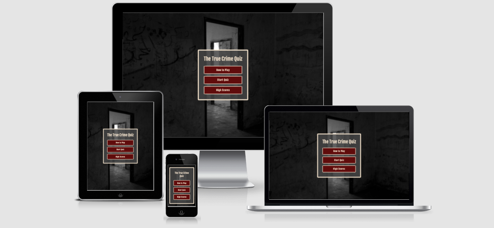
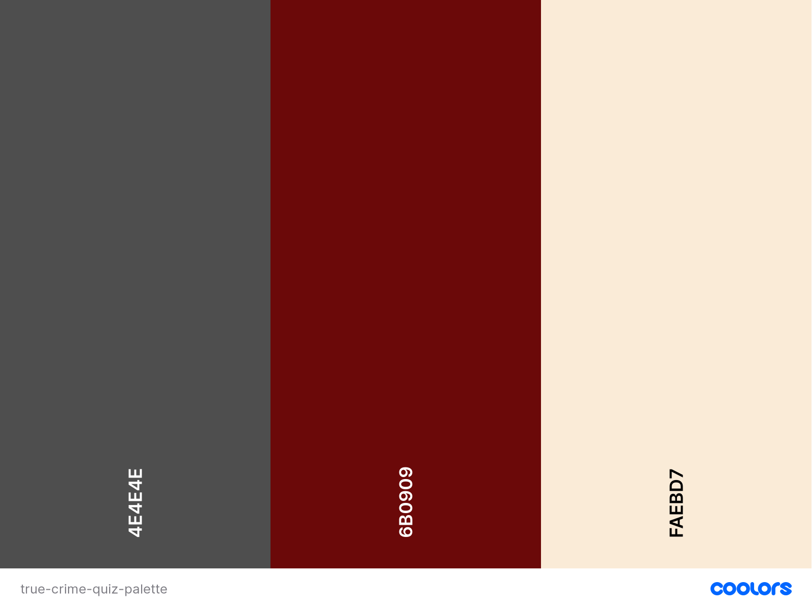
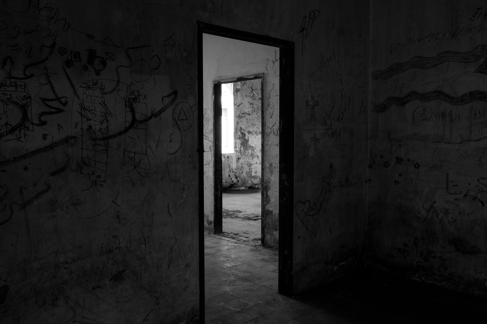
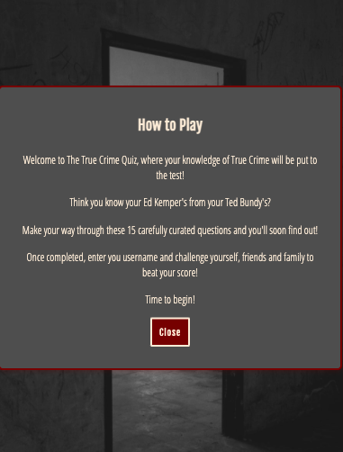
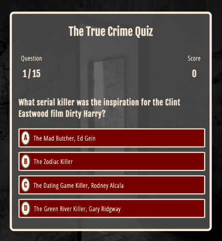
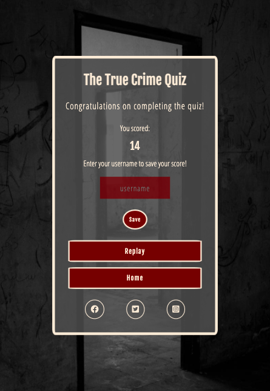
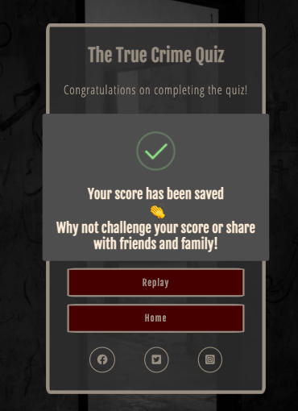
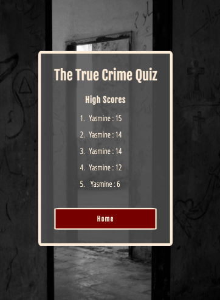
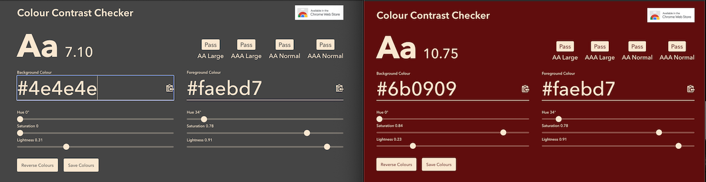
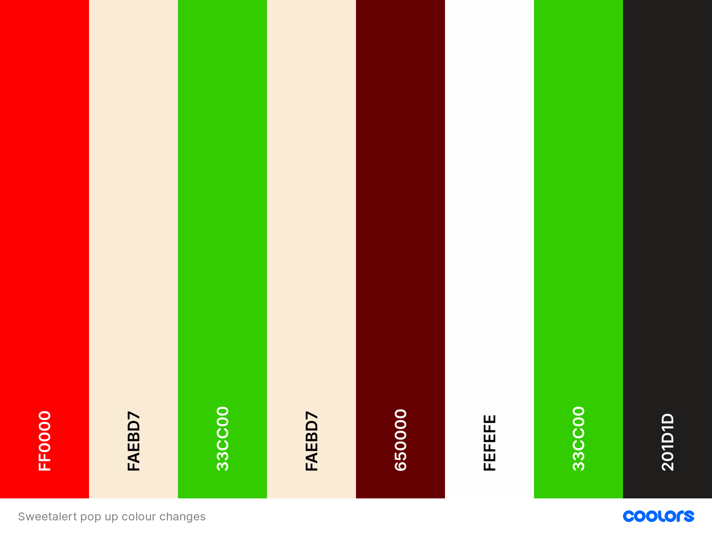

# The True Crime Quiz

## Introduction

Is it morbid fascination, simple human curiosity or is there something more to societies obsession with True Crime? Who knows, but the countless podcasts and YouTube channels, blog posts and documentaries dedicated to pretty much every case, theory and criminal shows we clearly can't get enough.
And as this project may suggest, I too am a member of the weirdly obsessed with True Crime club. So I decided to build a quiz based on the topic for my second Portfolio Project with Code Institute!  

The True Crime Quiz presents a selection of questions to test the user's knowledge and to hopefully impart something new to add to their True Crime knowledge bank. The top five scores are saved, so the user can challenge themselves, friends or family to make it to the scoreboard.

Anyone can take part in the quiz, however it is more so targeted to those who have a keen interest in the topic.

Visit my site [here](https://yasminebb.github.io/The-True-Crime-Quiz/).

## Table of Contents

- [The True Crime Quiz](#the-true-crime-quiz)
  - [Introduction](#introduction)
  - [Table of Contents](#table-of-contents)
  - [User Experience](#user-experience)
    - [User Stories](#user-stories)
  - [Design](#design)
    - [Colour Scheme](#colour-scheme)
    - [Typography](#typography)
    - [Images](#images)
  - [Features](#features)
    - [Home Page](#home-page)
    - [How To Play](#how-to-play)
    - [Quiz Page](#quiz-page)
    - [End Page](#end-page)
    - [High Scores](#high-scores)
    - [Future Features to Implement](#future-features-to-implement)
  - [Testing](#testing)
    - [Testing User Stories](#testing-user-stories)
    - [Validator Testing](#validator-testing)
    - [Mobile and Desktop Testing](#mobile-and-desktop-testing)
      - [Accessibility](#accessibility)
      - [Google Developer Tools - Lighthouse Testing](#google-developer-tools---lighthouse-testing)
      - [Responsiveness](#responsiveness)
  - [Deployment](#deployment)
    - [GitHub Pages](#github-pages)
    - [Forking](#forking)
    - [Cloning](#cloning)
  - [Credits](#credits)
    - [Code](#code)
    - [Technologies Used](#technologies-used)
    - [Content](#content)
    - [Media](#media)
    - [Acknowledgements](#acknowledgements)

## User Experience  

### User Stories  

- As the site creator:  

  - I want to create a quiz that is both enjoyable and challenging for the user.
  - I want to create a quiz that imparts knowledge to the user on the topic of true crime.
  - I want to create a quiz that is interactive and easy to use.
  - I want to create a quiz that is visually appealing to the user.  
  
- As a first time user:  

  - I want to play a quiz intuitively.
  - I want to have an insightful experience into the topic at hand, true crime.
  - I want to be able to see my results after playing the game.
  - I want to have the option to share this quiz with friends.  

- As a returning user:  

  - I want to challenge myself and improve on my scores.

## Design

I created a set of Wireframes which can be viewed [here](wireframes.md).

### Colour Scheme  

The colour scheme I have chosen for the quiz is overall darker tones with a lighter colour for maximum user accessibility.

### Typography

I have chosen two fonts to use across the site; 'Fjalla One', which is a medium-contrast display sans serif, and 'Open Sans Condensed'. Both taken from Google Fonts. 'Fjalla One' is used for the majority of headings and buttons and 'Open Sans Condensed' for all other text on the site.

### Images

There are of course many themes to use for the topic of True Crime, but I decided to choose a dark and eerie image as the background for the whole site to coincide with the theme of True Crime, without being too specific! The contrast between the dark image is clear with the colour scheme used for the quiz to ensure good accessibility for all users.

## Features

### Home Page

I designed a simple homepage with the title of the quiz, three buttons: How to Play, Start Quiz and High Scores.  

The simplicity aims to make it clean and unfussy to the user, giving them clear access to see the function of the page whilst giving all relevant information they will need, including where to start and how to play.

All buttons on the site have a slight box-shadow effect when hovered over. This is more visible when viewed on desktop, however, the effect still presents on mobile when the button is pressed.

### How To Play  

I have created a modal box that pops up when the button ‘How To Play’ is clicked on and explains the quiz to the user.

### Quiz Page

Once pressing the 'Start Quiz' button, the user is taken to the first question of the quiz page where they are presented with the question and four potential answers to choose from. The page displays a question counter, showing how far they are in the quiz, as well as their current score. The questions are jumbled so each time the user plays the game, a different set of order of the questions will present.

I have implemented a SweetAlert pop-up which displays once the user has selected a choice, and displays a different message depending on whether the choice was 'correct' or 'incorrect'.

Correct | Incorrect
 :--------: | :-----:
  | 

### End Page

Upon completing the quiz, the user is taken to the end page which displays the result they scored for the game and provides the option to save their score.  

Once the user has saved their score a pop-up is displayed.  

Links to social media sites are also displayed to encourage the user to share their score, a point mentioned in the How To Play pop-up on the Homepage. The top five scores are saved to local storage and can be accessed via the home screen by pressing the 'High Scores' button.

### High Scores

As mentioned above, the user can access their High Scores from the Homepage where they are presented with their top five overall scores.

### Future Features to Implement

Areas of development for this quiz include:  

- I would like to implement different levels of ability, with questions matching each level: 'Amateur', 'Intermediate' and 'Expert'. The user would be able to pick a level they feel their current knowledge matches, play that quiz, and can move up as they build their True Crime knowledge.

- I would also like to implement a feature whereby after each question is answered, a fact is provided and if the answer was incorrect, the correct answer, with a fact, would be shown on the screen.  

- Ideally in this quiz I would have liked to have created the option for the user to share their results automatically by clicking a button but wasn't able to make that happen at this stage, although this is a potential feature for the future.

## Testing

### Testing User Stories

**As a site creator:**  

- I want to create a quiz that is both enjoyable and challenging for the user.
  - After testing by having a few friends play the quiz, feedback I received was that the questions were challenging, but they enjoyed playing nonetheless.  
  
- I want to create a quiz that imparts knowledge to the user on the topic of true crime.
  - Feedback I received was they users learned new facts on the topic of True Crime.  
  
- I want to create a quiz that is interactive and easy to use.
  - The colourful pop-ups when answering questions and the ability to save and share high scores makes for a fun, interactive and easy to play quiz.  
  
- I want to create a quiz that is visually appealing to the user.  
  - The layout is clean and the image used and colour scheme tie in with the theme of True Crime. The pop-up alerts are colour coded to signify something to be 'true' or 'correct' (green) or 'false' or 'incorrect' (red).

**As a first time user:**  

- I want to play a quiz intuitively.  

  - The layout and buttons are clear on each page. There is a timer for each question set to 2000 without the option to click out of the page. The user doesn't have to click any buttons except for the answers they are choosing, and can see where they are in the quiz and what their score stands at. This is to ensure a smooth transition throughout the quiz and until the final score page. I debated implementing a button that takes the user back to the homepage from the quiz but decided it would be counterintuitive to a smooth experience of working through the quiz.
  
- I want to have an insightful experience into the topic at hand, True Crime.  

  - The selection of 15 questions provides an insight with many facts that aren't necessarily commonly known. This encourages the user to play the quiz again to build their knowledge.  

- I want to be able to see my results after playing the game.  

  - Once the game has been completed, the user is automatically taken to the end page where their score is displayed. The score itself is displayed in the 'Fjalla One' font which is bolder and makes it stand out.  
  
- I want to have the option to share this quiz with friends.  
  - The end page provides a link to several social media sites that, once clicked, will take the user to their dashboard where they can share their experience. Ideally I would have liked to create the option to share automatically and this is something I plan on implementing in the future.

**As a returning user:**  

- I want to challenge myself and improve on my scores.  

  - The High Scores feature encourages the user to replay the quiz and compare their scores to previous attempts in order to gain maximum scores, and maximum knowledge from the quiz.  
  
### Validator Testing

HTML  

- All HTML files were passed through the [W3C Validator](https://validator.w3.org/nu/?doc=https%3A%2F%2Fyasminebb.github.io%2FThe-True-Crime-Quiz%2F), presenting no errors.  

CSS  

- The CSS file was passed though the [Jigsaw W3C Validator](https://jigsaw.w3.org/css-validator/validator?uri=https%3A%2F%2Fyasminebb.github.io%2FThe-True-Crime-Quiz%2Fassets%2Fcss%2Fstyle.css&profile=css3svg&usermedium=all&warning=1&vextwarning=&lang=en), presenting no errors.  
  
JavaScript  

- All JavaScript files were passed through JSHint, presenting no errors.

### Mobile and Desktop Testing

#### Accessibility

To ensure the contrast of the colours used on the site meet Web Content Accessibility Guidelines (WCAG), I used a contrast checker which passed criteria.

Initially, I had picked different colours for the SweetAlert pop-ups, however, after testing these in a contrast checker, the background and foreground colours didn't adhere to WCAG standards.

The first half of this palette shows the colours I had initially used for the background and text of the incorrect and correct pop-ups respectively. The second half shows the shades they were changed to.

Initially, I wanted to keep the text for both results the same colour. This, however, wouldn't have been possible if I were to stick with this shade of green, which signifies something to be 'correct' or 'true', it wouldn't have passed the contrast checker. However, after changing to a darker colour for the correct pop-up text, I believe it further adds to signify the contrast between the two results.

#### Google Developer Tools - Lighthouse Testing  

When running Lighthouse testing, I used an incognito window to minimise any issues with performance ratings caused by my Chrome extensions. There were no issues to report.

[Lighthouse Testing Scores](lighthouse.md)  

#### Responsiveness

I faced a couple of challenges trying to ensure the site was responsive on all screen sizes and this mainly came down to the questions being different lengths.

To ensure the site is responsive across all screen sizes, I have added several media queries. One main issue I had was making sure the container stayed responsive across all screen sizes. I reduced some padding and font sizing for screen sizes 576px and down and got some help with tutor support who suggested using a transform property to scale the page container.

## Deployment

### GitHub Pages

To view a live preview of the site, the code has been deployed via GitHub pages. The following steps are to be followed to deploy via GitHub Pages:

1. Log into GitHub.
2. Navigate to the Repository.
3. Click on the 'Settings' tab.
4. Navigate to 'GitHub Pages' on the left-hand sidebar.
5. Under 'Source', select the dropdown which will be titled 'None'.
6. Select 'Main'.
7. Click 'Save'.

### Forking

In order to fork the project, the following steps are to be followed:

1. Log in to GitHub.
2. Navigate to the repository.
3. Find the 'Fork' button to the top right of the page.
4. Once you click this button the fork will be in your repositories.

### Cloning

In order to clone the project, the following steps are to be followed:

1. Log into GitHub.
2. Navigate to the repository.
3. Click on the 'Clone' button.
4. You will be provided with three options to choose from, HTTPS, SSH or GitHub CLI, click the clipboard icon to copy the URL.
5. Open Terminal.
6. Change the current working directory to the location where you want the cloned directory.
7. Type 'git clone' and paste the URL copied in step 3.
8. Click 'Enter'.

## Credits  

I have found JavaScript to be very challenging to grasp a strong comprehension of, and it has been a huge step up from CSS and HTML. Throughout the course of this project, I have used a wide range of online resources to help me understand JavaScript and will continue to do so.

I utilised the many resources available on YouTube to help build my understanding of JavaScript and to help build the quiz. In addition to the course content from Code Institute, I used resources such as Stack Overflow and the JavaScript module on Codecademy, using their run through projects to help improve my understanding.

### Code

- Code for the quiz was taken from the [Build a Quiz Playlist](https://www.youtube.com/watch?v=jfOv18lCMmw&list=PLDlWc9AfQBfZIkdVaOQXi1tizJeNJipEx&index=10) from James Q Quick.  

- Code for how to create a pop-up modal was taken from the [Create a Modal (Popup) with HTML/CSS and JavaScript](https://www.youtube.com/watch?v=XH5OW46yO8I) YouTube video from Florin Pop.

### Technologies Used  

- [GitHub](www.github.com) was used to create the repository and deploy the site.
- [VS Code](https://code.visualstudio.com/) and [Gitpod](https://www.gitpod.io/) were used to practice, build and develop code.
- The fonts used on the site were taken from [Google Fonts](https://fonts.google.com/).
- The colour scheme was generated using [Coolors](https://coolors.co/).
- The Favicon created for the site was made on [Favicon](https://favicon.io/).
- [Animate](https://animate.style/) library was used for some custom CSS animation styling.
- Custom pop up boxes were sourced from [SweetAlert](https://sweetalert2.github.io/#custom-class).
- Emojis used in the quiz were sourced from [Emojipedia](https://emojipedia.org/).
- [Am I Responsive](http://ami.responsivedesign.is/?url=https%3A%2F%2Fyasminebb.github.io%2FThe-True-Crime-Quiz%2F) was used to visualise the responsiveness of the site on a select number of screen sizes.
- [Colour Contrast Checker](https://colourcontrast.cc/33cc00/201d1d) was used to check the contrast of the colours used in the site against WCAG standards.
- Social media icons were taken from [Font Awesome](https://fontawesome.com/).

### Content

To build the questions for this quiz I used my own general knowledge as well as sourcing information and fact-checking from the following sites:  

- [Factinate](https://www.factinate.com/things/42-gruesome-facts-true-crime-cases/)
- [Crime and Investigation](https://www.crimeandinvestigation.co.uk/article/serial-killers-iqs-ranked)
- [Serial Killer Database](http://maamodt.asp.radford.edu/Serial%20Killer%20Information%20Center/Serial%20Killer%20Statistics.pdf)
- [Statista](https://www.statista.com/chart/20495/most-read-wikipedia-articles/)
- [Listverse](https://listverse.com/2018/07/02/10-murderers-who-used-their-genius-iqs-for-evil/) 10 Murderers Who Used Their Genius IQs For Evil
- [Listverse](https://listverse.com/2018/08/19/10-creepiest-letters-penned-by-serial-killers/) 10 Creepiest Letters Penned By Serial Killers
- [Listverse](https://listverse.com/2021/09/26/10-things-you-didnt-know-about-the-manson-girls/) 10 Things you didn't Know About the Manson Girls
- [Ranker](https://www.ranker.com/list/famous-serial-killer-last-words/ranker-crime)
- [The High Court](https://thehighcourt.co/serial-killer-facts/)
- [All Things Interesting](https://allthatsinteresting.com/famous-serial-killers#33)

### Media

The background image used on the site was taken from [Pexels](https://www.pexels.com/photo/black-wooden-door-frame-745054/).

### Acknowledgements

I would like to thank my mentor, Richard Wells, tutor support and the Slack community for the help I received in completing this project.
